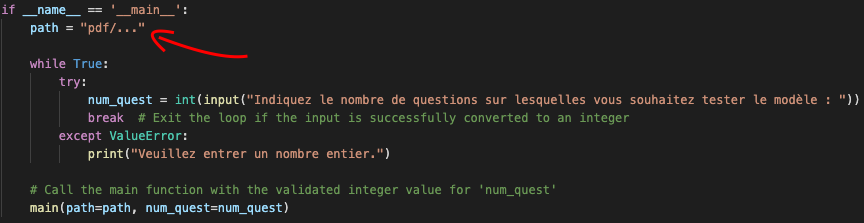
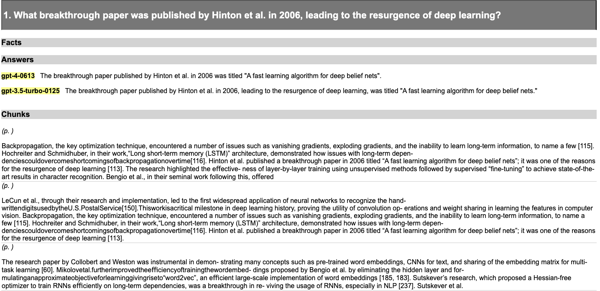

# RagFull [RF]

This project aims to test the generation capabilities of Large Language Models (LLMs) when integrated with a RAG (Retrieval-Augmented Generation) system. The process involves generating questions from a set of PDF documents, retrieving relevant context chunks for the questions, and evaluating the answers provided by LLMs.
In this project, we worked with two different datasets:

1st dataset: Tested with [course material](https://github.com/ImadZaoug/ragtime-projects/tree/main/Pdf_QA_tester/pdf/Test).

2nd dataset: An example dataset available [here](https://storage.recital.ai/s/ZnIx.GWJqg2ZXgGpPq4o).


## Generate your questions 

Navigate to the `question_generation.py` file and specify the `path` to one of the two datasets.

for the 1st dataset : `pdf/docs`

for the 2nd dataset : `pdf/Test`




Once done, execute `the question_generation.py` file. It will prompt you to specify the number of questions you would like to generate. After providing the desired number, the code will randomly select questions related to your dataset and save them in the directory `expe/01 Questions` as `questions--{Number of questions}Q_0C_0F_0M_0A_0HE_0AE_{time}.json`.

We attempted to work with the second dataset and obtained the JSON file `questions--10Q_0C_0F_0M_0A_0HE_0AE_2024-04-22_08h21,20.json`, which contains 10 randomly generated questions based on the dataset information. Here's how the json file appears.

```json
{
  "meta": {},
  "items": [
    {
      "meta": {},
      "question": {
        "meta": {},
        "text": "What is the significance of the value of replacement of a vehicle in the context of estimating damages?"
      },
      "facts": {
        "llm_answer": null,
        "meta": {},
        "items": []
      },
      "chunks": {
        "meta": {},
        "items": []
      },
      "answers": {
        "meta": {},
        "items": []
      }
    }
...
```

## Generate the chunks 

The next step is to retrieve the relevant chunks that would aid in answering the questions. To accomplish this, we define a retriever in the `classes.py` file as follows:

```python
class MyRetriever(Retriever, BaseRetriever):
    vector_retriever: VectorIndexRetriever
    bm25_retriever: BM25Retriever
        
        
    class Config:
        arbitrary_types_allowed = True

    def _retrieve(self, query: str, indexer=None, similarity_top_k: Optional[int] = None, **kwargs) -> list:
        bm25_nodes = self.bm25_retriever.retrieve(query, **kwargs)
        vector_nodes = self.vector_retriever.retrieve(query, **kwargs)

        # combine the two lists of nodes
        all_nodes = []
        node_ids = set()
        for n in bm25_nodes + vector_nodes:
            if n.node.node_id not in node_ids:
                all_nodes.append(n)
                node_ids.add(n.node.node_id)
        return all_nodes

    def retrieve(self, qa: QA, **kwargs):
        result = self._retrieve(qa.question.text, **kwargs)
        for r in result:
            chunk = Chunk()
            chunk.text , chunk.meta = r.text , {"score":r.score, "Node id" : r.node_id }
            # Check if the chunk already exists in qa.chunks
            existing_chunk = next((c for c in qa.chunks if c.text == chunk.text and c.meta == chunk.meta), None)
            if existing_chunk is None:
                qa.chunks.append(chunk)
```

We choose the hybrid approach because we observed that retrieving with embedding similarity and the similarity between the query and the document both provide important information. In the case of specific information about a company, retrieving chunks may be challenging due to certain words being embedded in a general context, or the model not being trained on certain words resulting in random embeddings. On the other hand, the BM25 method overcomes this problem and extracts chunks that treat the query most of the time. However, the embedding similarity often captures contextual nuances, which frequently yields precise information.

To extract chunks, go to `retrieve_chunks.py`, ensure the path to the question JSON file is correct, and execute the code. This script generates a varying number of chunks for each question, typically ranging between 10 and 20.

Using our hybrid retriever, we obtain 10 chunks with the `BM25Retriever` and 10 with the `VectorIndexRetriever`, eliminating redundant chunks. The resulting JSON file is stored in the same directory as the questions, named as `questions--{Number of questions}Q_{Number of chunks}C_0F_0M_0A_0HE_0AE_{time}.json`.

Here's a glimpse of our file `questions--10Q_170C_0F_0M_0A_0HE_0AE_2024-04-22_08h56,06.json`. We observe that our retriever has extracted 170 chunks, indicating 17 chunks for each question. This confirms that the two retrievers detected different chunks, validating our earlier analysis.

```json
{
  "meta": {},
  "items": [
    {
      "meta": {},
      "question": {
        "meta": {},
        "text": "What breakthrough paper was published by Hinton et al. in 2006, leading to the resurgence of deep learning?"
      },
      "facts": {
        "llm_answer": null,
        "meta": {},
        "items": []
      },
      "chunks": {
        "meta": {},
        "items": [
          {
            "meta": {
              "score": 33.192873923114384,
              "Node id": "1ede6fba-99a5-4386-85d2-51195c2dbb8d"
            },
            "text": "Backpropagation, the key optimization technique, encountered a\nnumber of issues such as vanishing gradients, exploding gradients, and\nthe inability to learn long-term information, to name a few [115].\nHochreiter and Schmidhuber, in their work,“Long short-term memory\n(LSTM)” architecture, demonstrated how issues with long-term depen-\ndenciescouldovercomeshortcomingsofbackpropagationovertime[116].\nHinton et al. published a breakthrough paper in 2006 titled “A fast\nlearning algorithm for deep belief nets”; it was one of the reasons for the\nresurgence of deep learning [113]. The research highlighted the effective-\nness of layer-by-layer training using unsupervised methods followed by\nsupervised “fine-tuning” to achieve state-of-the-art results in character\nrecognition. Bengio et al., in their seminal work following this, offered"
          },
          {
            "meta": {
              "score": 32.31338546294065,
              "Node id": "1c3c9ed7-2404-4905-89db-a2dd1b81257c"
            },
            "text": "LeCun et al., through their research and implementation, led to the\nfirst widespread application of neural networks to recognize the hand-\nwrittendigitsusedbytheU.S.PostalService[150].Thisworkisacritical\nmilestone in deep learning history, proving the utility of convolution op-\nerations and weight sharing in learning the features in computer vision.\nBackpropagation, the key optimization technique, encountered a\nnumber of issues such as vanishing gradients, exploding gradients, and\nthe inability to learn long-term information, to name a few [115].\nHochreiter and Schmidhuber, in their work,“Long short-term memory\n(LSTM)” architecture, demonstrated how issues with long-term depen-\ndenciescouldovercomeshortcomingsofbackpropagationovertime[116].\nHinton et al. published a breakthrough paper in 2006 titled “A fast\nlearning algorithm for deep belief nets”; it was one of the reasons for the\nresurgence of deep learning [113]."
          },
...
```
## Generate the answers 

For the answer generation phase, navigate to `main_answer_generation.py` and execute the `gen_Answers` function to obtain a new JSON file containing the integrated answers.

```python
generators.gen_Answers(folder_in=FOLDER_QUESTIONS, folder_out=FOLDER_ANSWERS,
                        json_file='questions--10Q_170C_0F_0M_0A_0HE_0AE_2024-04-22_08h56,06.json',
                        prompter=MCQAnsPptr(), b_missing_only=True,
                        llm_names=["gpt-4", "gpt-3.5-turbo","mistral/mistral-large-latest"],retriever = MyRetriever(vector_retriever=vector_retriever,bm25_retriever=bm25_retriever))
```

In this example, we utilized only 2 LLMs. If you wish to test more, add their names to `llm_names`. Please refer to the [litellm documentation](https://litellm.vercel.app/docs/providers) to ensure the correct names are used, and remember to set the required API key variable.

To export the JSON file in HTML and XLSX formats, run the following lines:

```python
expe.export_to_html(json_path=FOLDER_ANSWERS / 'questions--10Q_170C_0F_2M_20A_0HE_0AE_2024-04-22_09h26,25.json')
expe.export_to_spreadsheet(json_path=FOLDER_ANSWERS / "questions--10Q_170C_0F_2M_20A_0HE_0AE_2024-04-22_09h26,25.json",
                           template_path=FOLDER_SST_TEMPLATES/'spreadsheet_rich_template.xlsx')
```
Run the following lines from `export_to_html` to `export_to_spreadsheet` to export the JSON file in HTML format and XLSX format, respectively. Ensure that you specify the generated answer file as the JSON input file. You can find it in `expe/02 Answers` under the name `questions--{Number of questions}Q_{Number of chunks}C_0F_{Number of models}M_{Number of answers}A_0HE_0AE_{time}.json`. 

Here is the structure of our JSON file `questions--10Q_170C_0F_2M_20A_0HE_0AE_2024-04-22_09h26,25.json`:

```json
{
  "meta": {},
  "items": [
    {
      "meta": {},
      "question": {
        "meta": {},
        "text": "What breakthrough paper was published by Hinton et al. in 2006, leading to the resurgence of deep learning?"
      },
      "facts": {
        "llm_answer": null,
        "meta": {},
        "items": []
      },
      "chunks": {
        "meta": {},
        "items": [
          {
            "meta": {
              "score": 33.192873923114384,
              "Node id": "1ede6fba-99a5-4386-85d2-51195c2dbb8d"
            },
            "text": "Backpropagation, the key optimization technique, encountered a\nnumber of issues such as vanishing gradients, exploding gradients, and\nthe inability to learn long-term information, to name a few [115].\nHochreiter and Schmidhuber, in their work,“Long short-term memory\n(LSTM)” architecture, demonstrated how issues with long-term depen-\ndenciescouldovercomeshortcomingsofbackpropagationovertime[116].\nHinton et al. published a breakthrough paper in 2006 titled “A fast\nlearning algorithm for deep belief nets”; it was one of the reasons for the\nresurgence of deep learning [113]. The research highlighted the effective-\nness of layer-by-layer training using unsupervised methods followed by\nsupervised “fine-tuning” to achieve state-of-the-art results in character\nrecognition. Bengio et al., in their seminal work following this, offered"
          },
          ...
        ]
      },
      "answers": {
        "meta": {},
        "items": [
          {
            "llm_answer": {
              "meta": {},
              "text": "The breakthrough paper published by Hinton et al. in 2006 was titled \"A fast learning algorithm for deep belief nets\".",
              "prompt": {
                "meta": {},
                "user": "What breakthrough paper was published by Hinton et al. in 2006, leading to the resurgence of deep learning?",
                "system": "Contexte :  Backpropagation, the key ....."
              },
              "name": "gpt-4",
              "full_name": "gpt-4-0613",
              "timestamp": "2024-04-22T09:24:26.315908",
              "duration": 2.591401,
              "cost": 0.10671000000000001
            },
            "meta": {},
            "text": "The breakthrough paper published by Hinton et al. in 2006 was titled \"A fast learning algorithm for deep belief nets\".",
            "eval": {
              "llm_answer": null,
              "meta": {},
              "text": "",
              "human": 1,
              "auto": null
            }
          }
        ]
      }
    }
  ]
}
```

This is a snippet of the HTML generated after the answer generation :




## Manual Human Evaluation

Manually evaluate the generated answers by editing the JSON file saved in `expe/02 Answers`. Locate entries with `"human": null` and assign a score for each answer.
This step is essential and cannot be skipped for the subsequent processes.

```json
     "answers": {
        "meta": {},
        "items": [
          {
            "llm_answer": {
              "meta": {},
              "text": "The breakthrough paper published by Hinton et al. in 2006 was titled \"A fast learning algorithm for deep belief nets\".",
              "prompt": {
                "meta": {},
                "user": "What breakthrough paper was published by Hinton et al. in 2006, leading to the resurgence of deep learning?",
                "system": "Contexte :  Backpropagation, the key optimization ...
              },
              "name": "gpt-4",
              "full_name": "gpt-4-0613",
              "timestamp": "2024-04-22T09:24:26.315908",
              "duration": 2.591401,
              "cost": 0.10671000000000001
            },
            "meta": {},
            "text": "The breakthrough paper published by Hinton et al. in 2006 was titled \"A fast learning algorithm for deep belief nets\".",
            "eval": {
              "llm_answer": null,
              "meta": {},
              "text": "",
--------->    "human": 1,
              "auto": null
            }
```

## Fact Generation and Evaluation

1. **Fact Generation**: Uncomment relevant code in `main_fact_evals.py` to generate facts. Adjust the path to the JSON file.

2. **Evaluation**: Uncomment relevant lines in `main_fact_evals.py` to evaluate the generated facts. Ensure the JSON path is correct.

3. **Export Results**: Generate HTML and XLSX versions of the results using the provided commands. Make sure to use the correct JSON path.

## How to Run

1. Install the required dependencies:
   ```
   pip install -r requirement.txt
   ```

2. Follow the steps outlined above for question generation, context retrieval, answer generation, manual evaluation, fact generation, and evaluation.


## Results

To visualize the results, there is an HTML file in both "02. Answers" and "04. Evals" directories for both cases.

- Question answers for the course case: [Link](https://github.com/ImadZaoug/ragtime-projects/blob/main/Pdf_QA_tester/expe/02.%20Answers/questions--10Q_170C_0F_2M_20A_0HE_0AE_2024-04-22_09h29%2C27.html)

- Question answers for the Example dataset case: [Link](https://github.com/ImadZaoug/ragtime-projects/blob/main/Pdf_QA_tester/expe/02.%20Answers/questions--30Q_600C_0F_2M_60A_0HE_0AE_2024-04-24_14h17%2C45.html)

- Evals for the course case: [Link](https://github.com/ImadZaoug/ragtime-projects/blob/main/Pdf_QA_tester/expe/04.%20Evals/questions--10Q_170C_72F_2M_20A_20HE_20AE_2024-04-22_10h01%2C31.html)

- Evals for the Example dataset case: [Link](https://github.com/ImadZaoug/ragtime-projects/blob/main/Pdf_QA_tester/expe/04.%20Evals/questions--30Q_600C_174F_2M_60A_60HE_59AE_2024-04-24_14h29%2C52.html)

## Note

You can add other LLMs for evaluation by modifying the code accordingly and ensuring dependencies are met.
