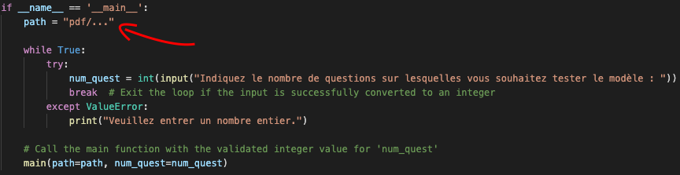
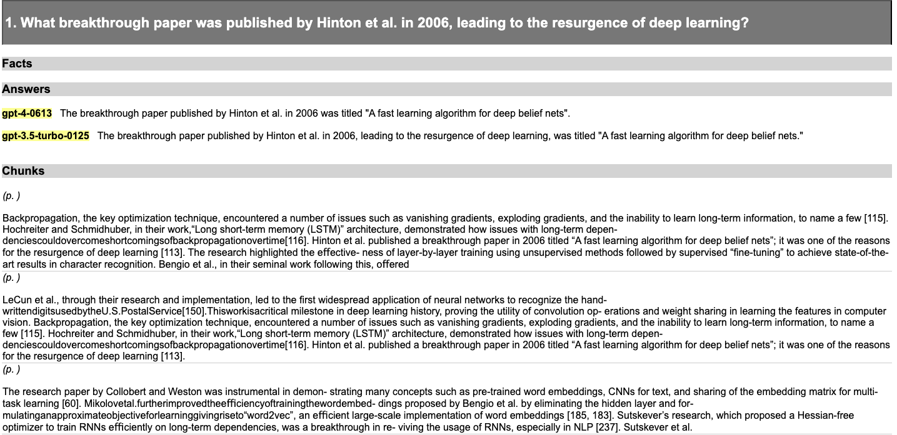
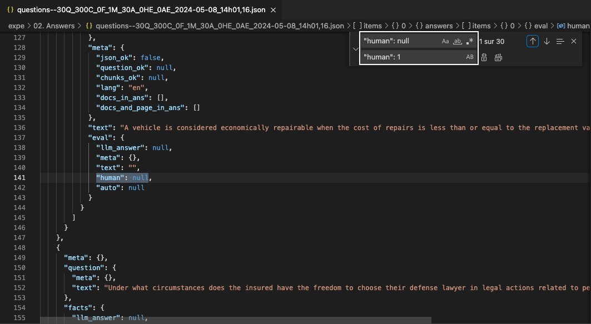
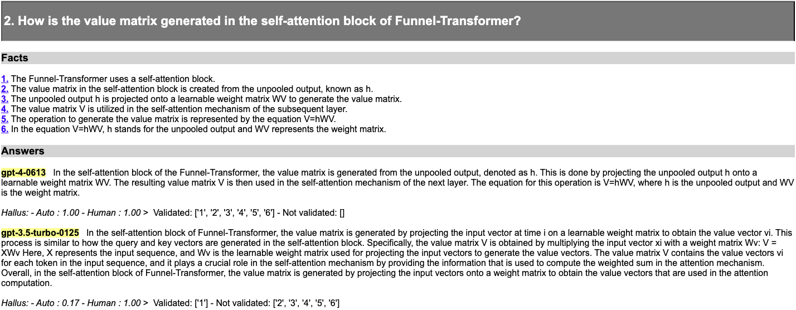
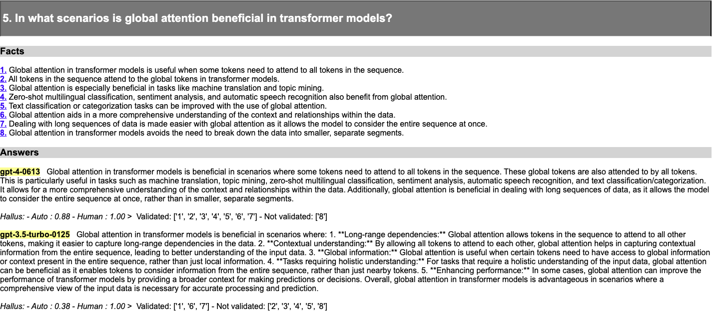

# RagFull [RF]

This project aims to test the generation capabilities of Large Language Models (LLMs) when integrated with a RAG (Retrieval-Augmented Generation) system. The process involves generating questions from a set of PDF documents, retrieving relevant context chunks for the questions, and evaluating the answers provided by LLMs.
In this project, we worked with two different datasets:

1st dataset: Tested with [course material](https://github.com/ImadZaoug/ragtime-projects/tree/main/Rag%20Full%20%5BRF%5D/pdf/Test).

2nd dataset: An example dataset available [here](https://storage.recital.ai/s/ZnIx.GWJqg2ZXgGpPq4o).


## Generate your questions 

Navigate to the `question_generation.py` file and specify the `path` to one of the two datasets.

for the 1st dataset : `pdf/docs`

for the 2nd dataset : `pdf/Test`




Once done, execute `the question_generation.py` file. It will prompt you to specify the number of questions you would like to generate. After providing the desired number, the code will randomly select questions related to your dataset and save them in the directory `expe/01 Questions` as `questions--{Number of questions}Q_0C_0F_0M_0A_0HE_0AE_{time}.json`.

We attempted to work with the second dataset and obtained the JSON file `questions--10Q_0C_0F_0M_0A_0HE_0AE_2024-04-22_08h21,20.json`, which contains 10 randomly generated questions based on the dataset information. Here's how the json file appears.

```json
{
  "meta": {},
  "items": [
    {
      "meta": {},
      "question": {
        "meta": {},
        "text": "What is the significance of the value of replacement of a vehicle in the context of estimating damages?"
      },
      "facts": {
        "llm_answer": null,
        "meta": {},
        "items": []
      },
      "chunks": {
        "meta": {},
        "items": []
      },
      "answers": {
        "meta": {},
        "items": []
      }
    }
...
```

## Generate the chunks 

The next step is to retrieve the relevant chunks that would aid in answering the questions. To accomplish this, we define a retriever in the `classes.py` file as follows:

```python
class MyRetriever(Retriever, BaseRetriever):
    vector_retriever: VectorIndexRetriever
    bm25_retriever: BM25Retriever
        
        
    class Config:
        arbitrary_types_allowed = True

    def _retrieve(self, query: str, indexer=None, similarity_top_k: Optional[int] = None, **kwargs) -> list:
        bm25_nodes = self.bm25_retriever.retrieve(query, **kwargs)
        vector_nodes = self.vector_retriever.retrieve(query, **kwargs)

        # combine the two lists of nodes
        all_nodes = []
        node_ids = set()
        for n in bm25_nodes + vector_nodes:
            if n.node.node_id not in node_ids:
                all_nodes.append(n)
                node_ids.add(n.node.node_id)
        return all_nodes

    def retrieve(self, qa: QA, nodes : list, **kwargs):
        result = self._retrieve(qa.question.text, **kwargs)
        results = Node_page(nodes=nodes, all_nodes = result)
        for key, r in results.items():
            chunk = Chunk()
            chunk.text , chunk.meta = r['text'] , {"score":r['score'], "Node id" : r['Node id'], "display_name" :r["display_name"], "page_number": r["page_number"] }
            # Check if the chunk already exists in qa.chunks
            existing_chunk = next((c for c in qa.chunks if c.text == chunk.text and c.meta == chunk.meta), None)
            if existing_chunk is None:
                qa.chunks.append(chunk)
```

We choose the hybrid approach because we observed that retrieving with embedding similarity and the similarity between the query and the document both provide important information. In the case of specific information about a company, retrieving chunks may be challenging due to certain words being embedded in a general context, or the model not being trained on certain words resulting in random embeddings. On the other hand, the BM25 method overcomes this problem and extracts chunks that treat the query most of the time. However, the embedding similarity often captures contextual nuances, which frequently yields precise information.

To extract chunks, go to `retrieve_chunks.py`, ensure the path to the question JSON file is correct, and execute the code. This script generates a varying number of chunks for each question, typically ranging between 10 and 20.

Using our hybrid retriever, we obtain 10 chunks with the `BM25Retriever` and 10 with the `VectorIndexRetriever`, eliminating redundant chunks. The resulting JSON file is stored in the same directory as the questions, named as `questions--{Number of questions}Q_{Number of chunks}C_0F_0M_0A_0HE_0AE_{time}.json`.

Here's a glimpse of our file `questions--10Q_170C_0F_0M_0A_0HE_0AE_2024-04-22_08h56,06.json`. We observe that our retriever has extracted 170 chunks, indicating 17 chunks for each question. This confirms that the two retrievers detected different chunks, validating our earlier analysis.

```json
{
  "meta": {},
  "items": [
    {
      "meta": {},
      "question": {
        "meta": {},
        "text": "What breakthrough paper was published by Hinton et al. in 2006, leading to the resurgence of deep learning?"
      },
      "facts": {
        "llm_answer": null,
        "meta": {},
        "items": []
      },
      "chunks": {
        "meta": {},
        "items": [
          {
            "meta": {
              "score": 0.849446624783471,
              "Node id": "87d57433-0a01-4af3-b8df-b066ce9c1227",
              "display_name": "Transformers for Machine Learning_ A Deep Dive.pdf",
              "page_number": "2"
            },
            "text": "John Hopfield introduced “Hopfield Networks”, one of the first recur-\nrentneuralnetworks(RNNs)thatserveasacontent-addressablememory\nsystem [117].\nIn 1986, David Rumelhart, Geoff Hinton, and Ronald Williams pub-\nlished the seminal work “Learning representations by back-propagating\nerrors” [217]. Their work confirms how a multi-layered neural network\nusing many “hidden” layers can overcome the weakness of perceptrons\nin learning complex patterns with relatively simple training procedures.\nThe building blocks for this work had been laid down by various research\nover the years by S. Linnainmaa, P. Werbos, K. Fukushima, D. Parker,\nand Y. LeCun [164, 267,91,196,149].\nLeCun et al., through their research and implementation, led to the\nfirst widespread application of neural networks to recognize the hand-\nwrittendigitsusedbytheU.S.PostalService[150].Thisworkisacritical\nmilestone in deep learning history, proving the utility of convolution op-\nerations and weight sharing in learning the features in computer vision."
          },
          {
            "meta": {
              "score": 0.8406410249743105,
              "Node id": "01ffa358-cd9e-44ce-bd87-d7ed74fd464e",
              "display_name": "Transformers for Machine Learning_ A Deep Dive.pdf",
              "page_number": "2"
            },
...
```
**Remark:** If you do not have an OpenAI API key and are unable to use MyRetriever, replace it with MyRetriever2.
MyRetriever2 exclusively utilizes the BM25 retriever, which does not require any embedding model.

## Generate the answers 

For the answer generation phase, navigate to `main_answer_generation.py` and execute the `gen_Answers` function to obtain a new JSON file containing the integrated answers.

```python
generators.gen_Answers(folder_in=FOLDER_QUESTIONS, folder_out=FOLDER_ANSWERS,
                        json_file='questions--10Q_170C_0F_0M_0A_0HE_0AE_2024-04-22_08h56,06.json',
                        prompter=PptrRAGAnsFR(), b_missing_only=True,
                        llm_names=["gpt-4", "gpt-3.5-turbo"],retriever = MyRetriever(vector_retriever=vector_retriever,bm25_retriever=bm25_retriever))
```

In this example, we utilized only 2 LLMs. If you wish to test more, add their names to `llm_names`. Please refer to the [litellm documentation](https://litellm.vercel.app/docs/providers) to ensure the correct names are used, and remember to set the required API key variable.

To export the JSON file in HTML and XLSX formats, run the following lines:

```python
expe.export_to_html(json_path=FOLDER_ANSWERS / 'questions--10Q_170C_0F_2M_20A_0HE_0AE_2024-04-22_09h26,25.json')
json_to_xlsx(name=FOLDER_ANSWERS /'questions--30Q_300C_0F_2M_58A_0HE_0AE_2024-05-08_22h56,42.json')

```
Run the following lines from `export_to_html` to `export_to_spreadsheet` to export the JSON file in HTML format and XLSX format, respectively. Ensure that you specify the generated answer file as the JSON input file. You can find it in `expe/02 Answers` under the name `questions--{Number of questions}Q_{Number of chunks}C_0F_{Number of models}M_{Number of answers}A_0HE_0AE_{time}.json`. 

Here is the structure of our JSON file `questions--10Q_170C_0F_2M_20A_0HE_0AE_2024-04-22_09h26,25.json`:

```json
{
  "meta": {},
  "items": [
    {
      "meta": {},
      "question": {
        "meta": {},
        "text": "What breakthrough paper was published by Hinton et al. in 2006, leading to the resurgence of deep learning?"
      },
      "facts": {
        "llm_answer": null,
        "meta": {},
        "items": []
      },
      "chunks": {
        "meta": {},
        "items": [
          {
            "meta": {
              "score": 33.192873923114384,
              "Node id": "1ede6fba-99a5-4386-85d2-51195c2dbb8d"
            },
            "text": "Backpropagation, the key optimization technique, encountered a\nnumber of issues such as vanishing gradients, exploding gradients, and\nthe inability to learn long-term information, to name a few [115].\nHochreiter and Schmidhuber, in their work,“Long short-term memory\n(LSTM)” architecture, demonstrated how issues with long-term depen-\ndenciescouldovercomeshortcomingsofbackpropagationovertime[116].\nHinton et al. published a breakthrough paper in 2006 titled “A fast\nlearning algorithm for deep belief nets”; it was one of the reasons for the\nresurgence of deep learning [113]. The research highlighted the effective-\nness of layer-by-layer training using unsupervised methods followed by\nsupervised “fine-tuning” to achieve state-of-the-art results in character\nrecognition. Bengio et al., in their seminal work following this, offered"
          },
          ...
        ]
      },
      "answers": {
        "meta": {},
        "items": [
          {
            "llm_answer": {
              "meta": {},
              "text": "The breakthrough paper published by Hinton et al. in 2006 was titled \"A fast learning algorithm for deep belief nets\".",
              "prompt": {
                "meta": {},
                "user": "What breakthrough paper was published by Hinton et al. in 2006, leading to the resurgence of deep learning?",
                "system": "Contexte :  Backpropagation, the key ....."
              },
              "name": "gpt-4",
              "full_name": "gpt-4-0613",
              "timestamp": "2024-04-22T09:24:26.315908",
              "duration": 2.591401,
              "cost": 0.10671000000000001
            },
            "meta": {},
            "text": "The breakthrough paper published by Hinton et al. in 2006 was titled \"A fast learning algorithm for deep belief nets\".",
            "eval": {
              "llm_answer": null,
              "meta": {},
              "text": "",
              "human": null,
              "auto": null
            }
          }
        ]
      }
    }
  ]
}
```

This is a snippet of the HTML generated after the answer generation :




## Manual Human Evaluation

Manually evaluate the generated answers by editing the JSON file saved in `expe/02 Answers`. 
Locate entries with `"human": null` by presssing CTRL+F, then search for `human`.


You will find all the human evaluation variables you need to change. You can change them manually one by one based on your judgment of the answer quality, or you can assign a value of 1 to all of them to proceed with the rest of the project. To assign a value of 1 to all of them, press CTRL+F, look for `"human" : null`, and replace it with `"human" : 1` as shown below.



This step is essential and cannot be skipped for the subsequent processes.

```json
     "answers": {
        "meta": {},
        "items": [
          {
            "llm_answer": {
              "meta": {},
              "text": "The breakthrough paper published by Hinton et al. in 2006 was titled \"A fast learning algorithm for deep belief nets\".",
              "prompt": {
                "meta": {},
                "user": "What breakthrough paper was published by Hinton et al. in 2006, leading to the resurgence of deep learning?",
                "system": "Contexte :  Backpropagation, the key optimization ...
              },
              "name": "gpt-4",
              "full_name": "gpt-4-0613",
              "timestamp": "2024-04-22T09:24:26.315908",
              "duration": 2.591401,
              "cost": 0.10671000000000001
            },
            "meta": {},
            "text": "The breakthrough paper published by Hinton et al. in 2006 was titled \"A fast learning algorithm for deep belief nets\".",
            "eval": {
              "llm_answer": null,
              "meta": {},
              "text": "",
--------->    "human": 1,
              "auto": null
            }
```

Here's the corrected version:

"If you prefer to evaluate the answers in XLSX format, navigate to the `expe/02. Answers` directory where you will find an XLSX version of your JSON file. The XLSX file will display all the chunks for each question in the answers.


To evaluate the quality of each answer, go to the last column named 'Human evaluations' and assign a score between 0 and 1 based on the provided chunks.


To update the JSON file with the evaluations you provided, run the `xlsx_to_json` function as follows:

```python
xlsx_to_json(json_path=FOLDER_ANSWERS/'questions--30Q_300C_0F_2M_58A_0HE_0AE_2024-05-08_22h56,42.json', xlsx_path=FOLDER_ANSWERS/'questions--30Q_300C_0F_2M_58A_0HE_0AE_2024-05-08_22h56,42.xlsx')
```

A new file with the same name, but appended with 'updated' at the end (for example, `questions--30Q_300C_0F_2M_58A_0HE_0AE_2024-05-08_22h56,42updated.json`), will appear in the `expe/02. Answers` directory with the human evaluations updated."
## Fact Generation and Evaluation

Here's the corrected version:

Now, for this part, we will generate facts for the questions we generated, which will serve as our basis for judging whether a certain LLM hallucinated or provided a proper answer using the `gen_Facts` function.

Remark: Set the fact generation and evaluation LLM to different ones from the ones that answered the questions. Using the same LLMs for both tasks may lead the model to overestimate its answers and tend to generate facts close to its answer. Hence, we intend to create the project `JudgeAndJury [JJ]`.

Set the JSON file path in this code to the answer JSON file:

```python
generators.gen_Facts(folder_in=FOLDER_ANSWERS, folder_out=FOLDER_FACTS, json_file='questions--10Q_170C_0F_2M_20A_0HE_0AE_2024-04-22_09h26,25.json',
                    llm_names=['mistral/mistral-large-latest'], prompter=PptrFactsFRv2())
```

Then you will get a new JSON file in `expe/03. Facts` under the name type `questions--{Number of questions}Q_{Number of chunks}C_{number of facts}F_{Number of models}M_{Number of answers}A_{Number of human evaluations}HE_0AE_{time}.json` for our example `questions--10Q_170C_72F_2M_20A_20HE_0AE_2024-04-22_09h43,16.json`.

We note that the facts were added for each question object as shown below:

```json
...
"facts": {
        "llm_answer": {
          "meta": {},
          "text": "1. The Funnel-Transformer uses a self-attention block.\n2. The value matrix in the self-attention block is created from the unpooled output, known as h.\n3. The unpooled output h is projected onto a learnable weight matrix WV to generate the value matrix.\n4. The value matrix V is utilized in the self-attention mechanism of the subsequent layer.\n5. The operation to generate the value matrix is represented by the equation V=hWV.\n6. In the equation V=hWV, h stands for the unpooled output and WV represents the weight matrix.",
          "prompt": {
            "meta": {},
            "user": "In the self-attention block of the Funnel-Transformer, the value matrix is generated from the unpooled output, denoted as h. This is done by projecting the unpooled output h onto a learnable weight matrix WV. The resulting value matrix V is then used in the self-attention mechanism of the next layer. The equation for this operation is V=hWV, where h is the unpooled output and WV is the weight matrix.",
            "system": "Génère un minimum de phrases numérotées courtes et simples qui décrivent ce paragraphe.\n        Chaque phrase doit être indépendante et aucune phrase ne doit contenir la même information qu'une autre phrase.\n        Les phrases ne doivent pas contenir de référence au document source ni à sa page.\n        Les phrases doivent être compréhensibles seules et donc ne pas contenir de référence aux autres phrases ni nécessiter les autres phrases pour être comprises."
          },
          "name": "gpt-4",
          "full_name": "gpt-4-0613",
          "timestamp": "2024-04-22T09:59:43.355848",
          "duration": 6.625835,
          "cost": 0.01344
        },
        "meta": {},
        "items": [
          {
            "meta": {},
            "text": "1. The Funnel-Transformer uses a self-attention block."
          },
          {
            "meta": {},
            "text": "2. The value matrix in the self-attention block is created from the unpooled output, known as h."
          },
          {
            "meta": {},
            "text": "3. The unpooled output h is projected onto a learnable weight matrix WV to generate the value matrix."
          }
...
```

Next, feed this new JSON file containing the answers to `gen_Evals` to get the final version of the JSON file containing all the necessary information.

```python
generators.gen_Evals(folder_in=FOLDER_FACTS, folder_out=FOLDER_EVALS, 
                    json_file='questions--10Q_170C_72F_2M_20A_20HE_0AE_2024-04-22_09h43,16.json',
                    llm_names=['mistral/mistral-large-latest'], prompter=PptrSimpleEvalFR())
```

Finally, to visualize the result, run the following line with the JSON file generated by the `gen_Evals` function:

```python
expe.export_to_html(json_path=FOLDER_EVALS / "questions--10Q_170C_72F_2M_20A_20HE_20AE_2024-04-22_09h58,19.json")
expe.export_to_spreadsheet(json_path=FOLDER_EVALS / "questions--10Q_170C_72F_2M_20A_20HE_20AE_2024-04-22_09h58,19.json",
                           template_path=FOLDER_SST_TEMPLATES/'spreadsheet_rich_template.xlsx')
```

We observed that the auto-evaluation has changed from null to a value between 0 and 1, indicating the number of validated facts divided by the total number of facts. Here is the HTML version: 



## How to Run

1. Install the required dependencies:
   ```
   pip install -r requirement.txt
   ```

2. Follow the steps outlined above for question generation, context retrieval, answer generation, manual evaluation, fact generation, and evaluation.


## Results

To visualize the results, there is an HTML file in both "02. Answers" and "04. Evals" directories for both cases.

- Question answers for the course case: [Link](https://github.com/ImadZaoug/ragtime-projects/blob/main/Pdf_QA_tester/expe/02.%20Answers/questions--10Q_170C_0F_2M_20A_0HE_0AE_2024-04-22_09h29%2C27.html)

- Question answers for the Example dataset case: [Link](https://github.com/ImadZaoug/ragtime-projects/blob/main/Rag%20Full%20%5BRF%5D/expe/02.%20Answers/questions--30Q_300C_0F_2M_59A_0HE_0AE_2024-05-06_17h40%2C15.html)

- Evals for the course case: [Link](https://github.com/ImadZaoug/ragtime-projects/blob/main/Pdf_QA_tester/expe/04.%20Evals/questions--10Q_170C_72F_2M_20A_20HE_20AE_2024-04-22_10h01%2C31.html)

- Evals for the Example dataset case: [Link](https://github.com/ImadZaoug/ragtime-projects/blob/main/Rag%20Full%20%5BRF%5D/expe/04.%20Evals/questions--30Q_300C_468F_2M_59A_60HE_59AE_2024-05-06_18h02%2C38.html)

## Note

For the next screen, I'll be presenting the results of the same experiment, but with fact generation and evaluation attributed to GPT-4.




Upon observation, it appears that the generated facts align more closely with GPT-4 than with the answers generated by GPT-3.5. This suggests that GPT-4 may receive a higher grade compared to GPT-3.5.

Also, we attempted to compare Claude3 Opus, one of the leading LLMs at the moment, with Gemini-Pro using the first dataset. Interestingly, when we assigned judgment to Gemini-Pro for both fact generation and evaluation, the results consistently favored Gemini, despite the apparent quality of responses from Claude3 Opus,furthermore, the answers from Gemini-Pro and the generated facts appear similar, with minor differences in their formulation. You can view the complete answers in this [link](https://github.com/ImadZaoug/ragtime-projects/blob/main/Rag%20Full%20%5BRF%5D/expe/04.%20Evals/questions--30Q_300C_468F_2M_59A_60HE_59AE_2024-05-06_18h02%2C38.html).


This raises the question: Is it crucial to select a different model to assess and evaluate the performance of other models, or is this observation merely a coincidence? Furthermore, how can we interpret these results to gain a better understanding of the functionality of large language models (LLMs)?
