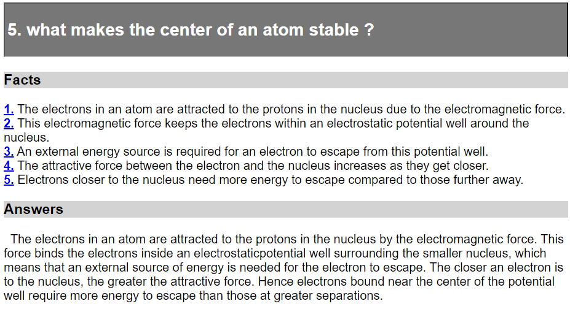
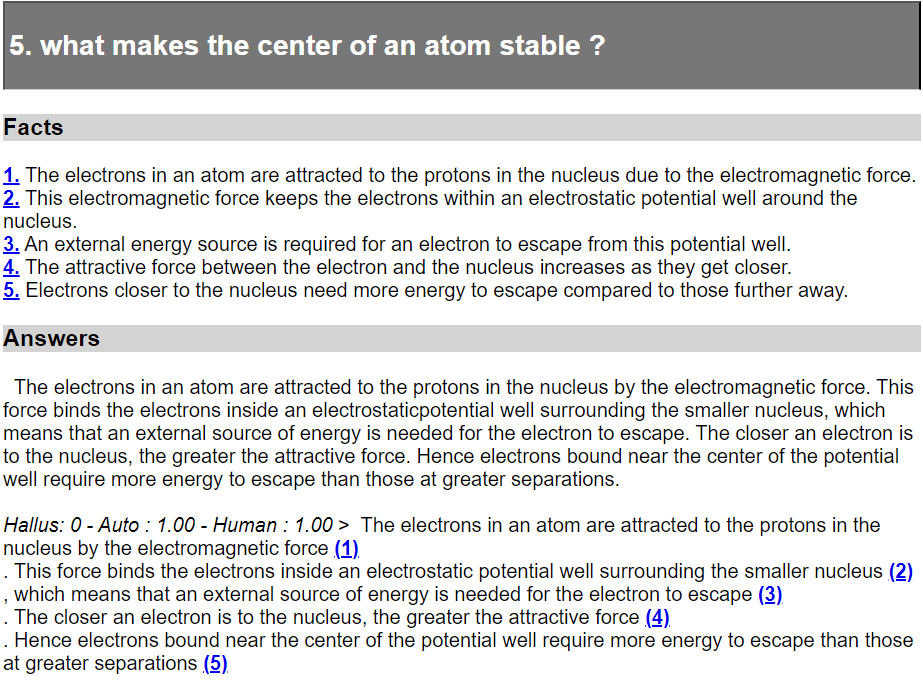
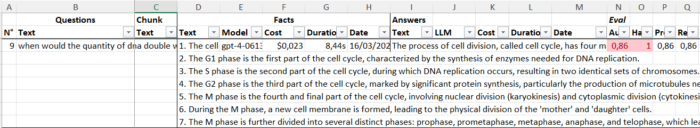
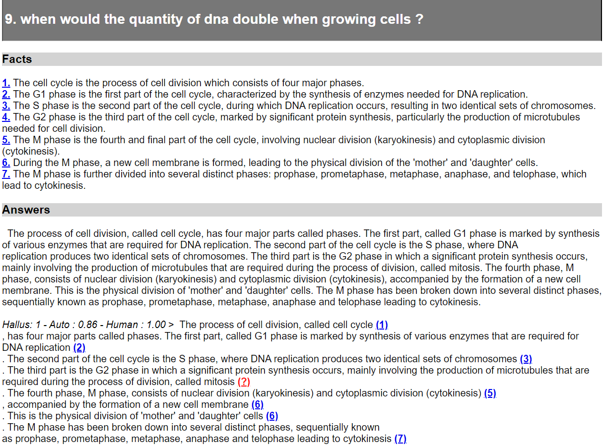
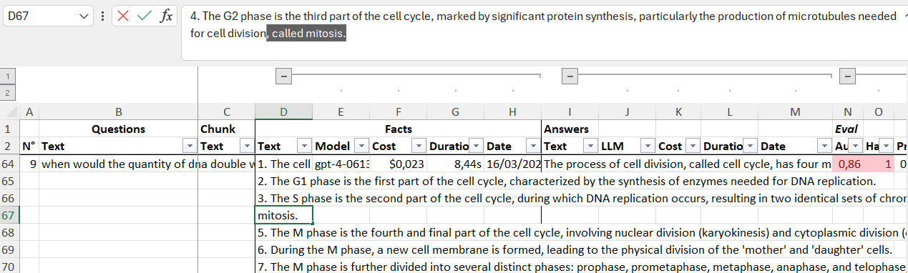

# Google Natural Questions
In this example, we show how to use the Fact generation and automatic Evaluation in  Ragtime 🎹 using the [Google Natural Questions dataset](https://ai.google.com/research/NaturalQuestions)

## The dataset
We are starting with 30 questions and answers from Google Natural questions, which is interesting here since the answers are long, as opposed to many other QA datasets where the answer is only a word, a date, a number etc...

The questions and answers are available in `res/02. Answers` in the repo:
- `original_google_nq.xlsx`: an extract from the table in the [Google NQ data browser](https://ai.google.com/research/NaturalQuestions/databrowser)
- `google_nq_json.xlsx`: an extract from the `original_google_nq.xlsx` plus a formula to convert it to a Ragtime 🎹 questions + answers JSON
- `google_nq.json`: the questions + answers JSON file

### What's inside this JSON file?
As opposed to the questions only JSON file used in [What do LLM think?](https://github.com/recitalAI/ragtime-projects), the JSON file used here contains questions and answers, plus a human evaluation.
Indeed, the answers stored in the Google NQ dataset are considered correct, and thus marked with `"human": 1`, e.g.:
```json
"question": {
    "text": "what makes the center of an atom stable ?"
},
"answers": {
    "items": [
        {
            "text": "The electrons in an atom are attracted to the protons in the nucleus by the electromagnetic force. This force binds the electrons inside an electrostaticpotential well surrounding the smaller nucleus, which means that an external source of energy is needed for the electron to escape. The closer an electron is to the nucleus, the greater the attractive force. Hence electrons bound near the center of the potential well require more energy to escape than those at greater separations.",
            "eval": {
                "human": 1
            }
        }
    ]
}
```

The action of marking answers as correct (technically, associating `"eval": {"human": 1}` with the answer) is usually done by human reviewers once the first set of answers has been generated by the LLMs. Here the answers are already present, hence this JSON file.

## Create the project
To do so, we first set `PROJECT_NAME='google_nq'` in `main.py` and run the script. It will create several sub folders as well as some 
files. 

Go to the `google_nq` subfolder and set the `PROJECT_NAME` variable in `main.py` to `'google_nq'`.

## Generating facts
Given the dataset of questions and validated answers, the Facts generation can be launched:
```python
generators.gen_Facts(folder_in=FOLDER_ANSWERS, folder_out=FOLDER_FACTS, json_file='google_nq.json',
                     llm_names=['gpt-4'], prompter=PptrFactsFRv2())
```
As for answers generation in [What do LLM think?](https://github.com/recitalAI/ragtime-projects), facts generation uses a generator, here a `FactsGenerator`. This generator uses an LLM, hence don't forget to specify your API key in the `OPENAI_API_KEY` environment variable (see [the LiteLLM doc](https://litellm.vercel.app/docs/set_keys) for more details).

Two things to be underlined compared to answer generation:
1. only 1 LLM is used to generate facts. Indeed, there is no use to compare different LLMs here, but rather to use one which generates facts correctly
2. we use the default prompter for facts generation, [`PptrFactsFRv2`](https://github.com/recitalAI/ragtime-package/blob/main/src/ragtime/generators.py#L207C1-L207C31) - except if it does not fit your needs, you can use it as is - hence no need to add a specific `classes.py`

Once the script is complete, a new JSON file is available in `res/03. Facts`, which should be named like `google_nq--30Q_0C_221F_1M_30A_30HE_0AE_2024-03-16_16h53,14.json`. 
The file name indicates that:
- there are 30 questions (`30Q`)
- there are 30 answers (`30A`) with 30 human evaluations (`30HE`)
- 221 facts have been generated (`221F`)
- using only one model (`1M`)

### Exporting facts
In order to see the the facts generated, you can export them in HTML and in a spreadsheet format (replace with the filename you have just generated):
```python
expe.export_to_html(json_path=FOLDER_FACTS / "google_nq--30Q_0C_221F_1M_30A_30HE_0AE_2024-03-16_16h53,14.json")
expe.export_to_spreadsheet(json_path=FOLDER_FACTS / "google_nq--30Q_0C_221F_1M_30A_30HE_0AE_2024-03-16_16h53,14.json")
```

The 2 files are generated in the same folder, i.e. `03. Facts`.

The HTML export is probably the most convenient to analyze the generated facts. The spreadsheet gives you numerical information - for instance here the generation of 30 facts using GPT-4 cost 0.5$ (sum of the column F in the spreadsheet)...

The HTML export looks like this:


The 5 facts have been generated from the answer. As we can see, the facts are as independent as possible, and mostly rephrase the different sentences contained in the answer.

## Testing facts
A good habit when facts have been generated is to test them using the same LLM used to generated them.
In this case, we run an automatic evaluation using the answers used to generate the facts (replace with your file name):
```python
generators.gen_Evals(folder_in=FOLDER_FACTS, folder_out=FOLDER_EVALS, 
                     json_file='google_nq--30Q_0C_221F_1M_30A_30HE_0AE_2024-03-16_16h53,14.json',
                     llm_names=['gpt-4'], prompter=PptrEvalFRv2())
```

The prompter used for the evaluation asks the LLM to rewrite the original answer including references to the facts within the text. It allows :
1. to easily review the correctness of the evaluation
2. to measure the facts actually found in the answer, vs. those missed or even those invented (in this case the LLM is asked to but a question mark)
The [prompt used in `PptrEvalFRv2()` is here](https://github.com/recitalAI/ragtime-package/blob/main/src/ragtime/generators.py#L235).


The generated file is in `04. Evals` and should be named like `google_nq--30Q_0C_221F_1M_30A_30HE_29AE_2024-03-16_23h24,01.json`. Compared to the previous file name, we see here that 29 automatic evaluations have been run (`29AE`).

Let us export the file in HTML and spreadsheet, as shown earlier - here again, replace the file name with yours.
```python
expe.export_to_html(json_path=FOLDER_EVALS / "google_nq--30Q_0C_221F_1M_30A_30HE_29AE_2024-03-16_23h24,01.json")
expe.export_to_spreadsheet(json_path=FOLDER_EVALS / "google_nq--30Q_0C_221F_1M_30A_30HE_29AE_2024-03-16_23h24,01.json", template_path=FOLDER_SST_TEMPLATES/'test_facts.xlsx')
```

The HTML output after an Eval shows, on top of the Facts and the Answers, the Evaluations, starting with `Hallus`.



In the example above, we see the answer written again with the facts mentioned and the sentences split. The evaluation contains exactly the text from the answer, with references to the facts and new lines inserted to make it more readable.
This layout can be changed in `res/html_templates/basic_template.jinja`.

The result for this answer is good, since there are no hallucination (`Hallus: 0`) and the automatic evaluation is 1 (`Auto: 1.00`), meaning all the facts have been found in the answer (facts from 1 to 5) and no other information has been added (no hallucination).

Let us now have a look at the generated spreadsheet. Please note it has been created using a specific template `test_facts.xlsx`. This template allows to quikcly identify the evaluations whose score is less than 1 and/or having hallucinations.
It should not happen in this case since this is a sanity check, i.e. we want to make sure the facts generated from the answer are actually found in the evaluation. It should be the case since the evaluated answers have also been used to generate the facts.

Incorrect evaluations appear in red in column N, "Eval / Auto":


Here, the question n°9 has an evaluation score of 0.86, indicating a potential error.
Let us see on the HTML output what the evaluation is:


We see that the fact n°4 is not found and is considered an hallucination instead (the red question mark).
Indeed, the term "mitosis" is used in the answer, but is not present in the fact n°4. In this case, the mistake happened during the fact generation since it has omitted the term "mitosis". We can associate it with the fact n°4 in the spreadsheet (cell D67) by adding "called mitosis" at the end of the fact text:


The next question whose evaluation is different from 1 is the number 23. In this case, the fact n°4 "4. These muscle spasms are another symptom of opioid discontinuation." is not mentioned in the answer. IT is however understated in Fact N°3. Hence Fract n°3 can be rephrased : "3. The term "kick the habit" refers to the muscle spasms that occur during opioid discontinuation.".

We repeat the same process, i.e. detecting evaluation not equal to 1 and fixing the facts. The resulting spreadsheet is saved with the prefix `fixed` in the same folder.

## Generating the validation set
We can now generate the validation set, i.e. a set of questions plus their associated facts.

To do so, we need to load the Expe file and update it with the facts which have been modified in the spreadsheet. Since the Expe file also contains information the LLM answers which have been generated, we can remove them so as to obtain a light weight validation set:
```python
# Load the original Expe file in JSON
expe:Expe = Expe(json_path=FOLDER_EVALS / "google_nq--30Q_0C_221F_1M_30A_30HE_29AE_2024-03-16_23h24,01.json")

# Update it with the spreadsheet we just edited
expe.update_from_spreadsheet(path=FOLDER_EVALS / "ready_to_gen_facts_google_nq--30Q_0C_221F_1M_30A_30HE_30AE_2024-04-01_00h50,33.xlsx", update_type=UpdateTypes.facts)

for qa in expe: # remove intermediate Answers and LLM Answers 
    qa.answers = Answers()
    qa.facts.llm_answer = None

# Save the resulting file as the validation set in the Fact folder
expe.save_to_json(path=FOLDER_FACTS / "validation_set.json")
```

# Compare LLMs
TODO
